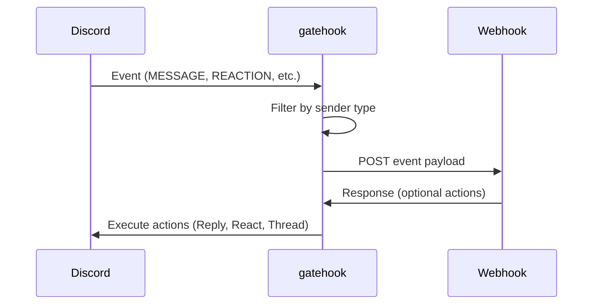

# gatehook

[](https://github.com/a24k/gatehook/actions/workflows/ci-rust.yml)
[](https://github.com/a24k/gatehook/actions/workflows/ci-docker.yml)
[](https://github.com/a24k/gatehook/actions/workflows/ci-audit.yml)

Bridge Discord Gateway (WebSocket) events to HTTP webhooks.

## Features

- 🎯 **Selective Event Handling** - Enable only the events you need via environment variables
- 🔍 **Fine-grained Sender Filtering** - Filter events by sender type (self, bot, user, webhook, system)
- 📨 **Context-aware Configuration** - Separate filters for Direct Messages and Guild (server) messages
- ⚡ **Dynamic Gateway Intents** - Automatically requests only the permissions needed for enabled events
- 🔐 **Secure by Default** - Bot's own events filtered out by default to prevent loops

## How It Works



## Getting Started

### Using Docker

```bash
docker run -d \
  -e DISCORD_TOKEN="your_discord_bot_token" \
  -e HTTP_ENDPOINT="https://your-webhook-endpoint.com/webhook" \
  -e MESSAGE_GUILD="user" \
  ghcr.io/a24k/gatehook:v1
```

### Using Docker Compose

1. Create a `compose.yml`:

```yaml
services:
  gatehook:
    image: ghcr.io/a24k/gatehook:v1
    env_file:
      - .env
    restart: unless-stopped
```

2. Create a `.env` file:

```env
# Required
DISCORD_TOKEN=your_discord_bot_token
HTTP_ENDPOINT=https://your-webhook-endpoint.com/webhook

# Event configuration (optional)
MESSAGE_GUILD=user
REACTION_ADD_GUILD=user,bot
```

3. Run:

```bash
docker compose up -d
```

### From Source

```bash
# 1. Clone the repository
git clone https://github.com/a24k/gatehook.git
cd gatehook

# 2. Set environment variables
export DISCORD_TOKEN="your_discord_bot_token"
export HTTP_ENDPOINT="https://your-webhook-endpoint.com/webhook"
export MESSAGE_GUILD="user"

# 3. Build and run
cargo run --release
```

## Configuration

### Required Environment Variables

| Variable | Description | Example |
|----------|-------------|---------|
| `DISCORD_TOKEN` | Discord bot token from Discord Developer Portal | `MTA1234...` |
| `HTTP_ENDPOINT` | HTTP endpoint URL to forward Discord events | `https://example.com/webhook` |

### Optional Environment Variables

| Variable | Description | Default | Example |
|----------|-------------|---------|---------|
| `INSECURE_MODE` | Accept invalid TLS certificates (testing only) | `false` | `true` |
| `HTTP_TIMEOUT` | HTTP request timeout in seconds | `300` (5 minutes) | `600` |
| `HTTP_CONNECT_TIMEOUT` | HTTP connection timeout in seconds | `10` | `30` |
| `MAX_RESPONSE_BODY_SIZE` | Maximum HTTP response body size in bytes (DoS protection) | `131072` (128KB) | `262144` |
| `MAX_ACTIONS` | Maximum number of actions to execute per event (DoS protection) | `5` | `10` |
| `RUST_LOG` | Logging level (see [Logging](#logging)) | `gatehook=info,serenity=warn` | `debug` |

### Event Handler Configuration

Events are configured via environment variables in the format: `<EVENT_NAME>_<CONTEXT>=<allowed_subjects>`

**Contexts:**
- `DIRECT` - Direct messages (1-on-1 and group DMs)
- `GUILD` - Guild (server) messages
- *(none)* - Context-independent events (e.g., `READY`)

**Allowed Subjects (comma-separated):**
- `self` - Bot's own messages
- `webhook` - Messages from webhooks
- `system` - Discord system messages
- `bot` - Messages from other bots
- `user` - Messages from human users
- `all` - All of the above
- *(empty string)* - Everything except self (default: `user,bot,webhook,system`)

**If an environment variable is not set, that event handler will not be registered.**

#### Available Events

<table>
  <thead>
    <tr>
      <th>Event</th>
      <th>Direct Variable</th>
      <th>Guild Variable</th>
      <th>Description</th>
    </tr>
  </thead>
  <tbody>
    <tr>
      <td>Ready</td>
      <td colspan="2" align="center"><code>READY</code></td>
      <td>Bot connected to Discord</td>
    </tr>
    <tr>
      <td>Resumed</td>
      <td colspan="2" align="center"><code>RESUMED</code></td>
      <td>Session resumed after reconnection</td>
    </tr>
    <tr>
      <td>Message</td>
      <td><code>MESSAGE_DIRECT</code></td>
      <td><code>MESSAGE_GUILD</code></td>
      <td>New message created</td>
    </tr>
    <tr>
      <td>Message Update</td>
      <td><code>MESSAGE_UPDATE_DIRECT</code></td>
      <td><code>MESSAGE_UPDATE_GUILD</code></td>
      <td>Message edited/updated</td>
    </tr>
    <tr>
      <td>Message Delete</td>
      <td><code>MESSAGE_DELETE_DIRECT</code></td>
      <td><code>MESSAGE_DELETE_GUILD</code></td>
      <td>Single message deleted</td>
    </tr>
    <tr>
      <td>Message Delete Bulk</td>
      <td align="center">-</td>
      <td><code>MESSAGE_DELETE_BULK_GUILD</code></td>
      <td>Multiple messages deleted at once (guild only)</td>
    </tr>
    <tr>
      <td>Reaction Add</td>
      <td><code>REACTION_ADD_DIRECT</code></td>
      <td><code>REACTION_ADD_GUILD</code></td>
      <td>Reaction added to a message</td>
    </tr>
    <tr>
      <td>Reaction Remove</td>
      <td><code>REACTION_REMOVE_DIRECT</code></td>
      <td><code>REACTION_REMOVE_GUILD</code></td>
      <td>Reaction removed from a message</td>
    </tr>
  </tbody>
</table>

#### Configuration Examples

```bash
# Example 1: Log all human messages in guilds, all DMs
MESSAGE_GUILD="user"
MESSAGE_DIRECT="user,bot,webhook,system"

# Example 2: Debug mode - include bot's own messages
MESSAGE_GUILD="all"
MESSAGE_DIRECT="all"

# Example 3: Only humans and other bots, no webhooks
MESSAGE_GUILD="user,bot"
MESSAGE_DIRECT="user,bot"

# Example 4: Everything except self (safe default)
MESSAGE_GUILD=""
MESSAGE_DIRECT=""

# Example 5: Enable READY event forwarding
READY="all"

# Example 6: Monitor session reconnections
RESUMED="all"

# Example 7: Log message deletions (no filtering available for delete events)
MESSAGE_DELETE_GUILD="all"
MESSAGE_DELETE_BULK_GUILD="all"

# Example 8: Monitor DM deletions
MESSAGE_DELETE_DIRECT="all"

# Example 9: Track reactions from users and bots
REACTION_ADD_GUILD="user,bot"
REACTION_ADD_DIRECT="user"

# Example 10: Track reaction removal events
REACTION_REMOVE_GUILD="user,bot"
REACTION_REMOVE_DIRECT="user"
```

### Sender Type Classification

Events with sender filtering (MESSAGE, REACTION_ADD, and REACTION_REMOVE) classify senders into mutually exclusive categories:

#### For MESSAGE Events

1. **self** - Bot's own messages
2. **webhook** - Webhook messages (excluding self)
3. **system** - Discord system messages (excluding self and webhooks)
4. **bot** - Other bot messages (excluding self and webhooks)
5. **user** - Human user messages (default/fallback)

**Note**: Discord webhooks have `author.bot = true`, but are classified as `webhook` rather than `bot` to allow separate filtering policies.

#### For REACTION_ADD and REACTION_REMOVE Events

1. **self** - Bot's own reactions
2. **bot** - Other bot reactions (excluding self)
3. **user** - Human user reactions (default/fallback)

**Note**: Webhook and system types don't apply to reactions (MESSAGE-only concepts).

This classification ensures:
- Every event is classified exactly once
- No ambiguity in filtering decisions
- Predictable behavior

## Event Forwarding Format

Events are forwarded to your HTTP endpoint as JSON POST requests with the event type specified as a query parameter.

### Ready Event Payload

Sent when bot connects to Discord (if `READY` is enabled):

```
POST {HTTP_ENDPOINT}?handler=ready
```

```json
{
  "ready": {
    "v": 10,
    "user": {"id": "123456789012345678", "username": "MyBot", "bot": true, ...},
    "guilds": [{"id": "987654321098765432", "unavailable": false}],
    "session_id": "...",
    "shard": [0, 1],
    "application": {"id": "123456789012345678", "flags": 0}
    // ... see Discord Ready event documentation
  }
}
```

Contains bot connection info: user, guilds, session_id, shard. See [Discord Ready event](https://discord.com/developers/docs/topics/gateway-events#ready).

### Resumed Event Payload

Sent when bot successfully resumes a session after reconnection (if `RESUMED` is enabled):

```
POST {HTTP_ENDPOINT}?handler=resumed
```

```json
{
  "resumed": {
    "_trace": ["..."]
    // ... see Discord Resumed event documentation
  }
}
```

Contains trace information for debugging. This event indicates the bot reconnected and resumed its session without losing state. See [Discord Resumed event](https://discord.com/developers/docs/topics/gateway-events#resumed).

### Message Event Payload

```
POST {HTTP_ENDPOINT}?handler=message
```

```json
{
  "message": {
    "id": "123456789012345678",
    "content": "Hello!",
    "author": {"id": "234567890123456789", "username": "user123", "bot": false, ...},
    "timestamp": "2024-01-15T12:34:56.789Z",
    "channel_id": "987654321098765432",
    "guild_id": "876543210987654321"
    // ... see Discord Message object documentation
  },
  "channel": {
    "id": "987654321098765432",
    "name": "general",
    "type": 0,
    "parent_id": null,
    "topic": "General discussion"
    // ... see Discord GuildChannel object documentation
  }
}
```

| Field | Present When | Description |
|-------|--------------|-------------|
| `message` | Always | Discord [Message](https://discord.com/developers/docs/resources/channel#message-object) object |
| `channel` | Guild messages | Discord [GuildChannel](https://discord.com/developers/docs/resources/channel#channel-object) object (omitted for DMs or cache miss) |

**Channel types:**
The `channel.type` field is an integer representing the channel type:
- `0` - Text channel (`GUILD_TEXT`)
- `2` - Voice channel (`GUILD_VOICE`)
- `10` - Announcement thread (`ANNOUNCEMENT_THREAD`)
- `11` - Public thread (`PUBLIC_THREAD`)
- `12` - Private thread (`PRIVATE_THREAD`)
- Other types: `4` (Category), `5` (News), `13` (Stage), `15` (Forum)

See [Discord's Channel Types](https://discord.com/developers/docs/resources/channel#channel-object-channel-types) for the complete list.

### Message Update Event Payload

```
POST {HTTP_ENDPOINT}?handler=message_update
```

```json
{
  "message_update": {
    "id": "1234567890123456789",
    "channel_id": "9876543210987654321",
    "guild_id": "1111111111111111111",  // null for DMs
    "content": "Updated content here",
    "edited_timestamp": "2024-01-15T12:35:00.789Z"
    // Only changed fields included (+ id, channel_id, guild_id always present)
  }
}
```

**Limitations:** Only changed fields provided. No sender filtering or webhook actions support. Cache original messages to access complete data.

### Message Delete Event Payload

```
POST {HTTP_ENDPOINT}?handler=message_delete
```

```json
{
  "message_delete": {
    "id": "1234567890123456789",
    "channel_id": "9876543210987654321",
    "guild_id": "1111111111111111111"  // omitted for DMs
  }
}
```

**Limitations:** Only IDs provided (no content, author, timestamp). No sender filtering or webhook actions support. Cache messages to track deleted content.

### Message Delete Bulk Event Payload

```
POST {HTTP_ENDPOINT}?handler=message_delete_bulk
```

```json
{
  "message_delete_bulk": {
    "ids": ["1234567890123456789", "2345678901234567890", "3456789012345678901"],
    "channel_id": "9876543210987654321",
    "guild_id": "1111111111111111111"
  }
}
```

**Guild-only event.** Same limitations as single delete (IDs only, no content).

### Reaction Add Event Payload

```
POST {HTTP_ENDPOINT}?handler=reaction_add
```

```json
{
  "reaction": {
    "user_id": "123456789012345678",
    "message_id": "987654321098765432",
    "channel_id": "111111111111111111",
    "guild_id": "222222222222222222",  // null for DMs
    "emoji": {"id": null, "name": "👍", "animated": false},
    "member": {"user": {...}, "roles": [...], "nick": "..."}  // guild only
    // ... see Discord Reaction object documentation
  },
  "channel": {
    "id": "111111111111111111",
    "name": "general",
    "type": 0
    // ... see Discord GuildChannel object documentation
  }
}
```

| Field | Present When | Description |
|-------|--------------|-------------|
| `reaction` | Always | Discord [Reaction](https://discord.com/developers/docs/resources/channel#reaction-object) object |
| `channel` | Guild reactions | Discord GuildChannel object (omitted for DMs or cache miss) |

**Emoji:** Unicode (`id`: null, `name`: "👍") or custom (`id`: emoji ID, `name`: emoji name). **Sender filtering:** `self`, `bot`, `user` (webhook/system don't apply).

### Reaction Remove Event Payload

```
POST {HTTP_ENDPOINT}?handler=reaction_remove
```

Payload structure is identical to Reaction Add event. See above for field descriptions.

## Webhook Response Actions

Your HTTP endpoint can respond with actions for gatehook to execute on Discord. Return a JSON object with an `actions` array:

```json
{
  "actions": [
    {"type": "reply", "content": "Hello!", "mention": false},
    {"type": "react", "emoji": "👍"},
    {"type": "thread", "name": "Discussion", "content": "Let's talk!"}
  ]
}
```

### Available Actions

All actions are available in `message`, `reaction_add`, and `reaction_remove` handlers (except `thread`, which is guild-only).

| Action | Parameters | Example | Notes |
|--------|------------|---------|-------|
| **reply** | • `content` (string, required)<br>• `mention` (boolean, optional, default: false) | `{"type": "reply", "content": "Got it!", "mention": false}` | Max 2000 chars, auto-truncated if exceeded |
| **react** | • `emoji` (string, required) | `{"type": "react", "emoji": "👍"}` | Unicode emoji or custom format `"name:id"` |
| **thread** | • `name` (string, optional)<br>• `content` (string, required)<br>• `auto_archive_duration` (int, optional, default: 1440) | `{"type": "thread", "name": "Topic", "content": "Discussion"}` | Auto-generates name from message if omitted. Guild channels only (not DMs). Valid durations: 60, 1440, 4320, 10080 (minutes) |

**Execution behavior:**
- Actions execute sequentially in array order
- If one action fails, remaining actions continue
- Content auto-truncates: 2000 chars for messages, 100 chars for thread names

**Error handling:**
- Non-2xx HTTP status: Actions still executed if present
- Invalid JSON: Logged as warning, no actions executed
- Empty response or `{"actions": []}`: No actions executed

## Supported Events

See [Available Events](#available-events) for currently supported Discord events. Gateway intents are automatically configured based on enabled events.

For planned feature support and roadmap, see [ROADMAP.md](ROADMAP.md).

## Logging

gatehook uses the [tracing](https://github.com/tokio-rs/tracing) crate for structured logging.

**Log Levels:** `error`, `warn`, `info` (default), `debug`, `trace`

**Examples:**
```bash
# Default logging
./gatehook

# Debug logging for gatehook, suppress serenity
RUST_LOG=gatehook=debug,serenity=warn ./gatehook

# Trace everything
RUST_LOG=trace ./gatehook
```

## Development

See [CLAUDE.md](CLAUDE.md) for development guidelines and architecture details.

## References

- [Discord Developer Portal - Overview of Events](https://discord.com/developers/docs/events/overview)
- [serenity](https://github.com/serenity-rs/serenity)
